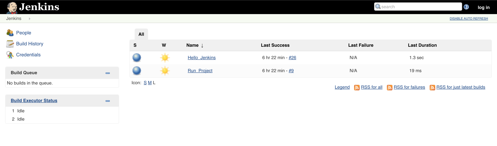
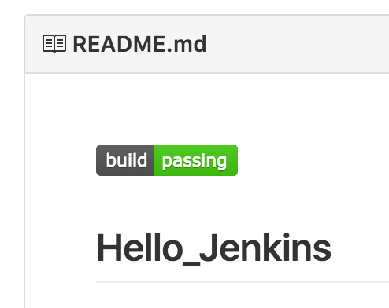
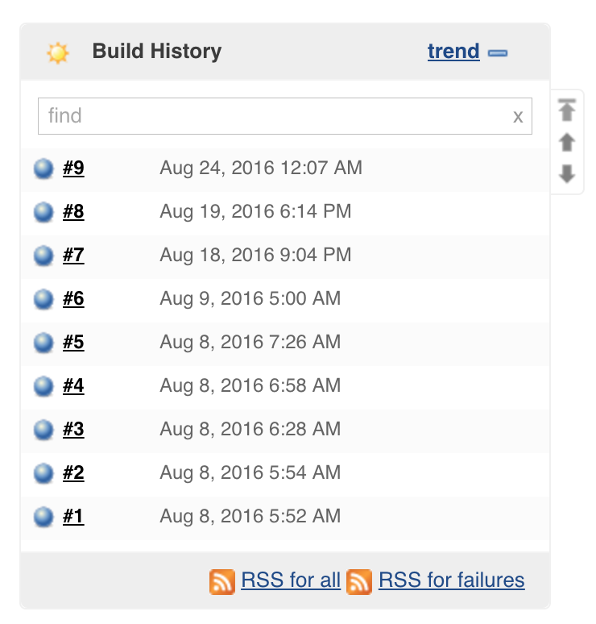

## Hello_Jenkins 
This simple exercise is designed to introduce you to Jenkins and continuous integration. This was originally written
as an exercise for California State University, Chico. I have since modified it to be a simple exercise for anyone
to use. 

### Overview
1. Fork the repo.
2. Set up job in Jenkins to connect to your repository and build C++ hello.cpp.
3. Set up build status badge.
4. Set up second job to run the program after build completes.

#### Prerequisites
A Jenkins server is needed in order to complete the exercise. One option is local virtualization using 
[Docker](https://hub.docker.com/r/jenkins/jenkins/) or a virtual machine. Another is installing Jenkins on a cloud 
platform like AWS. A t2.micro would be more than enough for this particular exercise. 

You should fork this repository and set up to run on your own. This will allow you to change and experiment to your
heart's desire. 

#### Setting up a Job in Jenkins

1. Navtigate to Jenkins server. 
2. Click _New Item_.
3. Enter a name for your project, click _Freestyle Project_, then _OK_.
  1. _Note_: Please do not include a space.
  2. Name this something unique so there are no collisions.
4. Set up _Source Code Management_.
  1. Select _git_.
  2. Enter the URL to your git repository
5. Setting up _Build Triggers_
  1. Select _Poll SCM_. 
  2. Set up cron job by putting in `H/2 * * * *`.
6. Set up _Build_.
  1. Add build step _Execute Shell_.
  2. Enter `make` (This will run the Makefile).
7. Click _Save_.

If you want a bit more of a challenge consider setting up Webhooks as opposed to polling. A fun Jenkins exercise that 
can get you thinking. 

#### Set up _Embeddable Build Status_ for Repo

The build status symbol often seen on a Github repository is normally connected
to TravisCI or JenkinsCI. We are using JenkinsCI which requires a plugin called
_Embeddable Build Status_. I have already installed it for you. You just need to
add the proper information into your README.md file.

1. Open the README file in a text editor.
2. Go to the _Embeddable Build Status_ page. The link is found on the main page of the job.
3. Select the _Markdown (with View) protected_ link and paste it in your README.
4. Commit your README changes and push to Github.
5. The change should automatically cause the job to build and after you can go to Github and check your repo. You should see the build status there

Because we selected _With View_ you will be able to click the build status icon which will take you to the Job in Jenkins.

#### Set up Second Job to Run the Compiled Program
The final step to this demo is to set up a second job that automatically runs
after the project builds. This is different than the other job because this will
not have a git repository - it doesn't even build anything.

_Just a note: In a real-life scenario you wouldn't run a program through a
build job just like this because I/O is not possible via this console. There
are other tools people use at this step like SeleniumHQ, SonarQube, or a
Deployment. The point of this is to show downstream/upstream job relationships._

1. Create a new Job in Jenkins
  1. Click _New Item_.
  2. Enter a name for your second job, click _Freestyle Project_, then _OK_.
  3. Go immediately to build step and select _Execute Shell_.
  4. Enter the following Command `/var/lib/jenkins/workspace/<the name of your first project>/hello_exec`
  5. Save
2. Set your first job to call the second
  1. Go to your first job and open the _Configure_ page.
  2. Scroll to bottom and add a Post-Build Action. Select _Build other projects_.
  3. Enter the name of your second job.
  4. Save
3. Run your first job
  1. Do this by clicking `build now` on the main page.
  2. After that successfully builds go and check your second job.
  3. You should see it successfully run.
  4. Select a Build Job from History and go to the console log to see your program output. If you program has run there then you successfully set up a basic pipeline.

### Wrapping it up
As you can see, Jenkins has a ton of opportunity which makes it the leading CI tool for modern enterprise and software 
development. Jobs don't have to be explicitly build jobs which mean you can do other tasks like deployments, promotions,
testing, feedback, and much more.

### Thank You  
Justin Bankes <justin@liatrio.com>  
